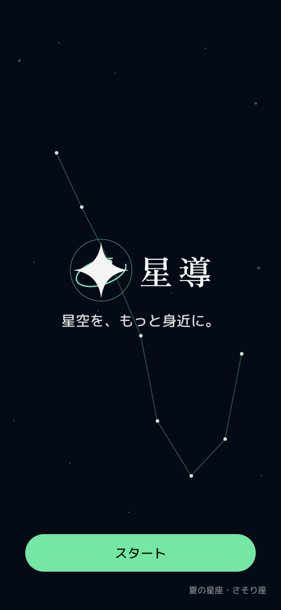

# 星しるべ

> 空にかざしたSABERAへ星座を重ね、見ている星空を音声で案内するアプリ

## できること

- スマホのセンサーとSABERAの6DoFから、見ている方向を求める
- 星・星座線・星座名・月・惑星・人工衛星をSABERAへ重ねる
- ツルを1回タップして、見ている星座の解説を聞く
- 解説文をSABERAへ字幕で表示し、スマホから読み上げる
- ツルを長押しして、星空について声で質問する
- 設定から都市と日時を指定し、その場所の星空を表示する
- 表示中の星空の時間を段階的に進める
- 88星座の解説を端末へ同梱し、圏外でも案内する

## 画面プレビュー

### スマホ



- 採用ロゴ、季節の星座、開始ボタンを表示する
- 実装と同じ素材・色・配置から作ったプレビュー
- 作り直し：`java -Djava.awt.headless=true tools/compose-phone-preview.java`

### SABERA


- 黒い部分は光らず、肉眼の空が透けて見える
- 星座線と実際の星がつながる位置へ表示する
- 首が止まってから星図を更新し、転送中の点滅を抑える


- 解説中は星図を消し、1枚3行の字幕を1行ずつ送る
- 1回タップすると星図へ戻る
- 読み上げと字幕が終わると、5秒後に自動で戻る
- 画像は見え方の説明用で、実機の写真ではない

## 実装状況

- **実機確認済み**
  - 星図と星座名の表示
  - 首の向きへの追従
  - 方位合わせ
  - 観測地の測位
- **実装済み・実機確認待ち**
  - 星座解説の字幕と読み上げ
  - 音声での質問
  - 人工衛星の描画
  - 採用ロゴのスマホ・ランチャー・SABERA表示
  - 主要18都市の日時指定
  - 表示中の星空の段階的な時間再生
- **JVMテスト済み**
  - 座標変換
  - 星座判定
  - 衛星の軌道計算（SGP4 / SDP4）

最新の状態は [仕様書の入口](docs/team-e/00_index.md) を参照。

## 動かす

- Android実機とSABERAを用意する
- JDK 17とAndroid Studioを入れる
- private SDK取得用のGitHub PATを設定する
- 詳細は [CONTRIBUTING.md](CONTRIBUTING.md) を読む

```bash
cd samples/kmp
./gradlew :app:installDebug
```

- `OPENAI_API_KEY`はAI音声と声の質問にだけ使う
- APIキーがなくても、同梱の解説と端末の読み上げで動く
- 秘密情報はリポジトリへコミットしない

## 開発者向けリンク

- [仕様・実装状況](docs/team-e/00_index.md)
- [グラス出力の制約](docs/team-e/02_glass-output.md)
- [画面遷移とジェスチャー](docs/team-e/05_app-flow.md)
- [コードとデータの地図](docs/team-e/10_code-map.md)
- [実装上の落とし穴](docs/team-e/11_pitfalls.md)
- [実機で測った数字](docs/team-e/12_measurements.md)
- [コントリビューションガイド](CONTRIBUTING.md)
- [Sabera App SDK 公開ドキュメント](https://jig-sabera.github.io/sabera-sdk/)

## ライセンス

- サンプル・ラッパーコード： [Apache License 2.0](LICENSE)
- Sabera App SDK本体：SDK利用規約（Apache License 2.0の対象外）
- 同梱の星表データ：BSD-3-Clause。帰属は [NOTICE](NOTICE)
