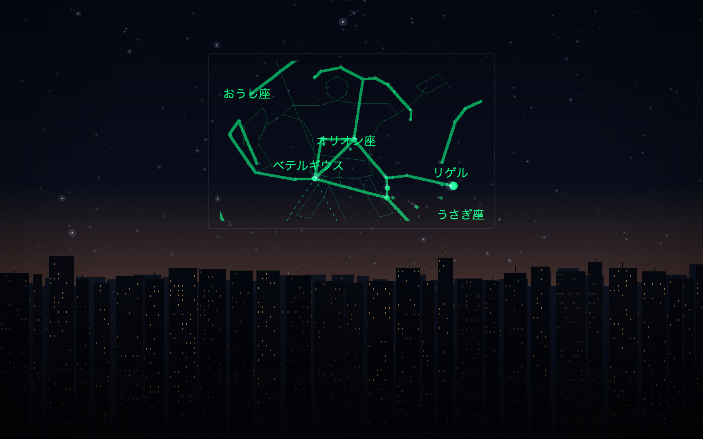
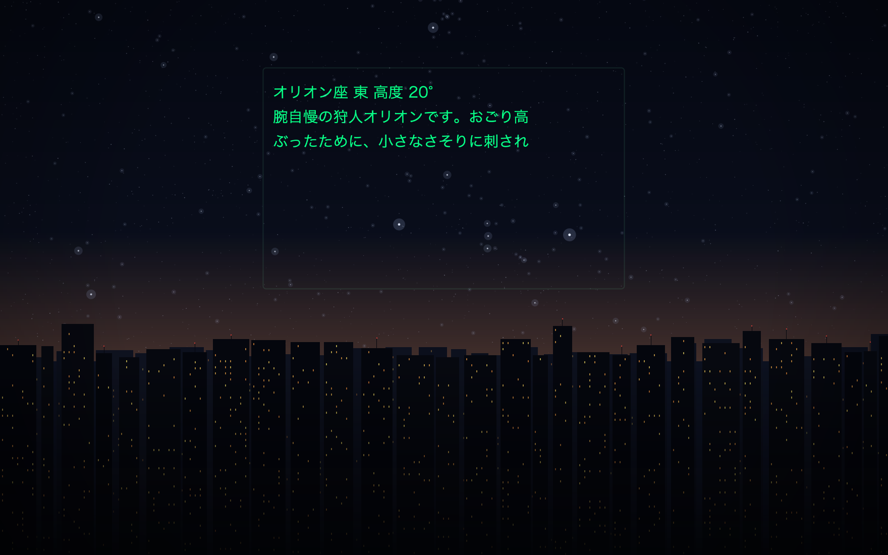

# SABERA team-e

> jig.jp サマーインターン SABERA コース

## 概要

**空にかざすと視界と星座が重なり、AI に頼むと今見えている星座を解説してくれるアプリ**

- スマホのセンサーとグラスの 6DoF から視野内の星座を割り出す
- グラスに星図と星座名を出す
- ツルを 1 回タップすると、その星座の解説が返ってきて読み上げられる
- **人工衛星モード**に切り替えると、いま空を通っている衛星を同じ座標で出す

## 見え方

**かけている人にはこう見える**というイメージ図。**パネルは視野全体ではなく、正面より少し上に
小さく浮かんでいる。** 黒い画素は光らないので、枠の中も外も肉眼の空がそのまま透けている。

| 星図 ＋ 星座名 | 解説画面（#40） |
|---|---|
|  |  |
| 星座線・星座絵・一等星の名前。**線の頂点と空の星が重なる** | 星図を消して文字だけにする（**うしろの空はそのまま見えている**）。1 枚 3 行を 1 行ずつ上へ流す |

- 枠の中は**アプリが実際に送っている絵**（`StarMapRenderer` の出力をそのまま焼いたもの）
- 空は **2026-01-01 18:00 の鯖江から東の空**。星の位置と明るさは**星図と同じ計算**なので、
  枠の中の星座線と、枠の外に見えている星がつながる
- **実機の写真ではない。** 街のシルエットと 5 等より暗い星は雰囲気のための飾り。
  **画角は未実測**（仮の 35°）なので枠の大きさも仮で、パネルのにじみ・明るさ・
  実機のフォント・薄く描いた枠線も実物とは違う

作り直しは [コードとデータの地図](docs/team-e/10_code-map.md#ドキュメント用の画像)。
**スマホ側の画面は実機のスクリーンショットが要る**（BLE がつながらないと星図の画面まで進まない）。

## 進捗状況

- 実装は `samples/kmp/app`
- 仕様は [docs/team-e/00_index.md](docs/team-e/00_index.md)

| | 状態 |
|---|---|
| 星図をグラスに出す | **実機で確認済み。** キャンバスに 528×330、星座名はテキストで手前に重ねる |
| 首の向きに追従する | **実機で確認済み。** 首が止まってから 1 枚（転送中は前の絵が消える） |
| 方位合わせ | **実機で確認済み。** グラスの十字とスマホのマーカーを重ねる |
| 観測地の測位 | **実機で確認済み。** 融合 → GPS → 基地局。取れなければ手入力 |
| 星座解説と読み上げ | **同梱の解説文**（88 星座）を読み上げ、グラスの解説専用画面へ文字で出す。**通信は要らない**。**実機確認待ち** |
| 衛星の軌道計算（SGP4 / SDP4） | **JVM テストのみ。** 参照実装と 4mm 差。24 機＋スターリンク 10,748 機を同梱 |
| 衛星の描画とモード切り替え | **実機未確認** |
| 設定画面からの明るさ調節 | **実機で調整中。** 手動5段階。設定後に星図を再送して反映する |

## 開発の仕方

1. [CONTRIBUTING.md](CONTRIBUTING.md) を読む
2. **GitHub PAT を設定する**（これが無いとビルドが通らない → [docs/github-pat.md](docs/github-pat.md)）
3. **Android 実機**を用意する（BLE 必須。エミュレータでは動かない）

```bash
cd samples/kmp
./gradlew :app:installDebug
```

- 読み上げを AI 音声にするなら `cp .env.example .env` して `OPENAI_API_KEY` を書く
  （**無くても解説は喋る**。端末の読み上げに落ちるだけ）

## リポジトリの歩き方

| パス | 中身 |
|---|---|
| [docs/team-e/00_index.md](docs/team-e/00_index.md) | **team-e の仕様書の入口。** 決まったこと・実装状況・各ドキュメントへの地図 |
| [AGENTS.md](AGENTS.md) | AI エージェント向けの**禁止事項と規約**（人間が読んでもよい） |
| [CONTRIBUTING.md](CONTRIBUTING.md) | 環境構築・進め方・コミット規約・困ったとき |
| [docs/team-e/10_code-map.md](docs/team-e/10_code-map.md) | **どこに何のコードがあるか**・同梱データの作り方・ビルドの前提 |
| [docs/team-e/11_pitfalls.md](docs/team-e/11_pitfalls.md) | 実機と実装で**踏んだ落とし穴** |
| [docs/team-e/12_measurements.md](docs/team-e/12_measurements.md) | **実機で測った数字**の台帳 |
| `samples/kmp/app/` | **アプリ本体**（Kotlin + Compose） |
| `data/` / `tools/` | 同梱データ（すべて生成物）と生成スクリプト |
| [docs/github-pat.md](docs/github-pat.md) | privateなSDKを取得するためのPAT設定 |

## SDK について

- このアプリは **Sabera App SDK**（`jp.jig.sabera.app.sdk:sabera-app-core`）の上に作る
- 上流 → [jig-SABERA/sabera-sdk](https://github.com/jig-SABERA/sabera-sdk) /
- 公開ドキュメント → **<https://jig-sabera.github.io/sabera-sdk/>**

- **0.6.0 まで取り込み済み**
- team-e が使っている主な API — `sendCanvasImage`（星図）/ `sendCanvasElements`（星座名）/
  `imuData`（6DoF）/ `gestureEvents`（ツルの操作）
- **グラスから音は鳴らせない**（スピーカーが無い）。読み上げはスマホから
- 制約の詳細 → [グラス出力の制約](docs/team-e/02_glass-output.md)

SDKの使い方・APIリファレンス・追加履歴は
[上流の公開ドキュメント](https://jig-sabera.github.io/sabera-sdk/)を正とする。
このリポジトリには[GitHub PATの作り方](docs/github-pat.md)だけを置く。

### SDK の取得設定

private な GitHub Packages（`jig-SABERA/sabera-sdk-packages`）で配布されている。
**`read:packages` スコープの PAT が要る。** `~/.gradle/gradle.properties` に置く：

```properties
GitHubPackagesUsername=<GitHubのユーザー名>
GitHubPackagesPassword=<read:packages を持つ PAT>
```

**Android 実機のみを対象にしている。** iOS 向けの SPM 定義（`Package.swift`）は
上流でも SDK 0.0.10 のまま追従していないので、team-e では撤去した。

## ライセンス

| 対象 | ライセンス |
|---|---|
| このリポジトリのサンプル・ラッパーコード | [Apache License 2.0](LICENSE) |
| Sabera App SDK 本体（AAR / XCFramework） | **SDK 利用規約**（Apache 2.0 の対象外） |
| 同梱の星表データ（d3-celestial / XHIP） | BSD-3-Clause。帰属は [NOTICE](NOTICE) |
