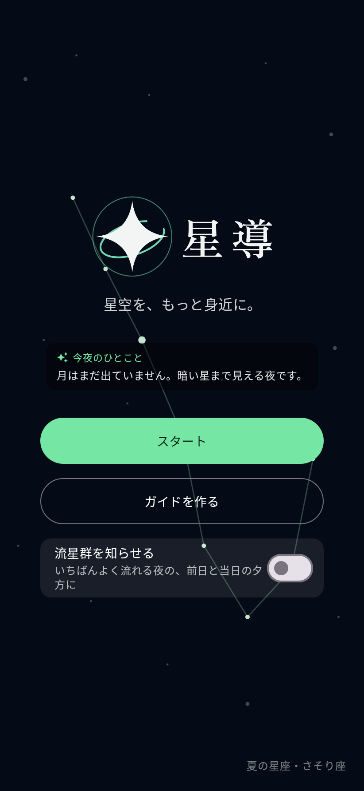
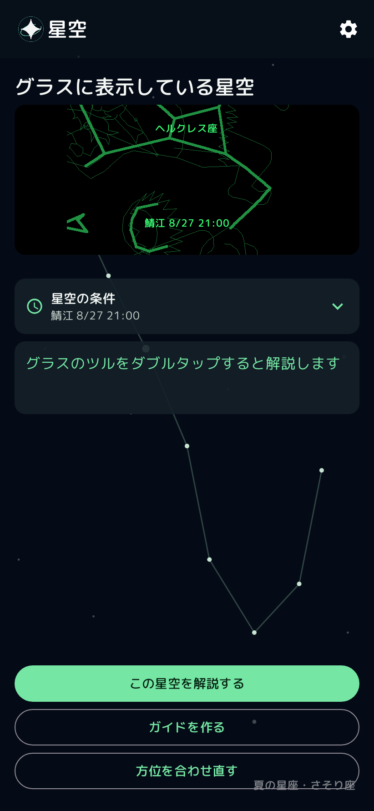

# 星導

## 概要

> SABERAをかけて空を見上げると星座が重なり、見ている星空をハンズフリーで案内するアプリ

- ツルをダブルタップで、見ている星座の解説を聞く
- ツルを長押しして、星空について声で解説する
- 探したい星座をガイドしてくれる機能
- プラネタリウム風BGMと音声・テキスト解説
- 都市と日時を指定し、その場所の星空を再現
- 星座情報をアプリに同梱しているため、圏外でも案内可能

## 画面プレビュー

- 以下は、SABERA側・スマホ側それぞれのデモ画像
- 実際の画面ではない

### SABERA

### スマホ

 

## ライセンス

- サンプル・ラッパーコード： [Apache License 2.0](LICENSE)
- Sabera App SDK本体：SDK利用規約（Apache License 2.0の対象外）
- 同梱の星表データ：BSD-3-Clause。帰属は [NOTICE](NOTICE)
