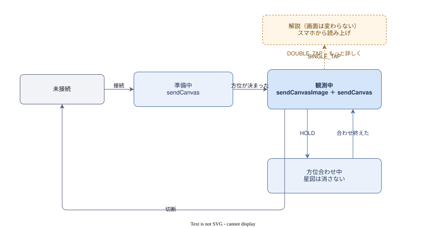

# 画面遷移とジェスチャー

ユーザーが何を触ると何が起きるか、そのときグラスとスマホに何が出ているか。
座標変換の中身は [座標変換パイプライン](coordinate-system.md)。

## 基本方針

**操作系はグラスで完結させる。** スマホは見なくても使える。

| | 役割 |
|---|---|
| **グラス** | 星図と星座名を出す。ジェスチャーで操作を受ける |
| **スマホ** | 計算する。音声を鳴らす。**同伴者に見せる**。詰まったときの整備画面 |

グラスをかけている人は空を見ていて**スマホは見ない**。星を見に行くのは複数人のことが多く、
**グラスは 1 人しかかけられない**ので、スマホ画面は同伴者のためにある。

**例外は初回の接続だけ。** `showAutomaticSelectionDialog(activity)` が Activity を要求するため
スマホ操作が避けられないが、`connectToLastDevice()` を呼んでおけば 2 回目以降は自動接続になる。
`hasLastConnectedDevice` で初回かどうかを分岐できる。

## ジェスチャー割り当て

使えるのは `SINGLE_TAP` / `DOUBLE_TAP` / `HOLD` の 3 つだけ。

| ジェスチャー | 割り当て | 状態による違い |
|---|---|---|
| `SINGLE_TAP` | **解説の開始／停止** | 待機中は開始、解説中は停止（トグル） |
| `DOUBLE_TAP` | **星座 ⇄ 人工衛星の切り替え** | いつでも有効 |
| `HOLD` | **方位を合わせる** | いつでも有効 |

- **`SINGLE_TAP` をトグルにしたのは誤タップ対策。** ツルは触れやすく、かけ直しただけで発火する
- **「あれは何？」は視線の向きで完全に決まる**ので、**タップそのものが質問になっている**。
  最初の一言に音声入力は要らない
- **`HOLD` を方位合わせにしたのは、いつでも呼べる必要があるから**
- **`DOUBLE_TAP` は人工衛星モードとの行き来に使う**（[人工衛星モードの調査](satellites.md)）。
  もともと当てていた「もっと詳しく」は**行き先が無くなった**ので、
  AI 解説を作るときに割り当てを決め直す

`gestureEvents` は `SharedFlow` なので、**購読を始める前のジェスチャーは受け取れない**。
接続完了 → 購読開始 → 「準備できました」を出す、の順を守る。

**リモコンのイベントは 0.5.0 で SDK から撤去された**ので、アプリでは拾えない。
それでも**戻る操作でキャンバスは閉じられる**ので、閉じられた前提で送り直せるようにしておく。

## グラスに何を出すか

**キャンバス（576×360）に星図画像を置き、その手前に星座名を重ねる。**

```
┌─────────────────────────── 576 ───────────────────────────┐
│   おとめ座                        しし座                    │  ← sendCanvas（テキスト）
│         ·      ·                                           │
│      ·      ·        ·                                  360│
│         ·         ·                                        │  ← sendCanvasImage（星図・528×330 まで）
│              ·                                             │
└────────────────────────────────────────────────────────────┘
```

| 出すもの | API | 制約 |
|---|---|---|
| 星図 | `sendCanvasImage(id, x, y, w, h, grayscale)` | **id 0..7 の 8 枚**。`x+w ≤ 576` / `y+h ≤ 360` |
| 星座名 | `sendCanvas` / `sendCanvasElements` | **8 要素・合計 190 バイト**まで |

- **星図は id を固定した 1 枚で足りる。** 同じ id に送ると座標ごと差し替わるので、
  消してから送り直す必要はない（消すなら `removeCanvasImage(id)`）
- **枚数より先にバッファが尽きる。** 置いてある画像の `w × h × 2` の合計が 380,000 バイトまでで、
  **576×360 は画素だけで 414,720 になり 1 枚でも入らない**。全画面に寄せるなら **528×330** が上限

- **どちらも送るだけで画面が切り替わる。** 先にページを開かなくてよい
- 星座名は平均 14.8 バイトなので **8 個並べても約 118 バイト**。
  視野に入る星座は FOV 40° で平均 5.2 個なので**枠はちょうど足りる**
- **ナビ表示中はキャンバス画像が使えない**（バッファを共有している）

**解説文はグラスに出さない。** 190 バイトでは入らないし、星図の上に長文を重ねると星が読めない。
**グラスは星図と星座名まで**にして、解説はスマホと音声に逃がす。

### 出し先はキャンバス（576×360）

- **星図を `sendCanvasImage` で画像として置き、星座名を `sendCanvasElements` のテキストで手前に重ねる**
- `FEATURE_VERSION 2.2.0` が要る。**手元のグラスは更新済みで動く**

途中まで 2.1.0 台のファームで動かず、3 段の切り分けで原因を特定した：

| 送ったもの | 必要な版 | 2.1.0 台での結果 |
|---|---|---|
| `sendCanvas`（文字だけ） | 2.1.0 | 出た |
| `sendCanvasImage`（キャンバスの画像） | **2.2.0** | **出なかった** |
| `enterImageDisplayPage` ＋ `sendImage` | 要件なし | 出た |

- SDK チームからは「使える」と聞いていたが、**実機は追いついていなかった**。
  伝聞で確定させず、送って確かめる価値があった
- **退路 = `enterImageDisplayPage` ＋ `sendImage`（196×196、星図だけ）。**
  古いファームのグラスでも星図は出せる
- **星座名は差分更新（`sendCanvasElements`）なので、余った id を空文字で消す。**
  消さないと前のフレームの名前が残る
- **0.6.0 で SDK が分割送信を直列化した。** 画像とテキストを続けて送ってもチャンクは混ざらない。
  0.5.0 までは送信が重なるとどちらも組み立てられなかったので、送る順を気にする必要があった

## 画面遷移



- **キャンバス 1 枚で回る。** ページ遷移が要らないので、状態はほぼ「観測中かどうか」だけ
- **方位合わせ中は星図を消して十字だけを出す。** 画像バッファは全画像の合計で見るので、
  528×330 の星図と十字は同時に置けない（[座標変換パイプライン ⑧](coordinate-system.md)）
- **解説中もグラスの画面は変わらない。** 音声はスマホから鳴る
- **終わるときは `closeCanvas()` か `enterHomePage()` を送る。**
  送らないとアプリが居ないのに星図が出たままになる

### 星図の更新 — 「首が止まったら 1 枚」

**転送中、グラスは前の絵を捨てて何も出さない。** 528×330 で 1 枚 1 秒近くかかるので、
動きに追従して送り続けると**点いては消えるだけ**になる。実機のログで確かめた失敗：

```
1.2 秒おきに送信 / 1 枚の転送に約 1.0 秒 → 絵が出ているのは 1 周期のうち 0.2 秒
```

そこで**動いている間は前の絵を出したままにして、止まってから送る**。

| 条件 | 値 |
|---|---|
| 「動いている」とみなす角速度 | 0.1 秒で 1° 以上 |
| 止まったと判断するまで | 0.4 秒 |
| 送り直すずれ | 前に送った絵から 6° 以上 |

- **姿勢が動かなくても更新は要る。** 星は日周運動で **15″/秒**（4 分で 1°）動く
- **送信の呼び出しは積むだけで返る。** 転送しきるまでの見積り時間は次を送らない
  （見積りは 200 バイト × 20ms/本。実時間は測れていないので画面のつまみで詰める）
- **星座名は画像のあとに送る。** 先に送ると、画像が届くまでの 1 秒近く名前だけが浮く
- **星座名は差分更新なので毎フレーム送ってよい。** 位置が視線とともに動くため、
  名前が同じでも送り直す。余った id は空文字で消す

## 夜空で使うためのグラス設定

`sendSetting(name, value)` でグラス本体の設定を書き換えられる。
キー一覧は上流ドキュメントに無く、AAR の `CommandManager.SettingKey` から読み取ったもの（17 個）。
**値の範囲と意味は未確認。**

| キー | なぜ効くか |
|---|---|
| `BRIGHTNESS_LEVEL` / `BRIGHTNESS_AUTO` | **暗順応。** 明るいまま出すと肉眼の空が見えなくなる |
| `SCREEN_OFF_TIME` | **見上げたまま何分も止まる**使い方なので、途中で消えると成立しない |
| `MESSAGE_DISPLAY_MODE` / `NOTIF_CONTENT_MASK` | **通知が出ると星図が消える**（同時には出せない） |
| `FONT_SIZE` | 星座名の大きさが変わる |
| `FEATURE_VERSION` | ファームの機能バージョン（読み出し経路が不明） |

`sendWakeupTiltThreshold(degrees)` は**見上げでグラスが起きる傾きのしきい値**。
星を見る姿勢と正面衝突するが、噛み合わせれば**空を見上げた瞬間に星図が出る**入り口にもなる。

`requestSystemStatus()` で**バッテリー残量・装着状態・充電状態**を要求できる。
装着状態が取れれば、外している間の送信を止められる。
ただし応答は `parseResponse` 経由で、**読み出し経路は設定値と同じ問題を抱えている**。

## スマホの画面

**星図の 1 画面だけ。** 役割は「方位を合わせる」「グラスに映っているものを見る」
「ログを見る」の 3 つ。それ以外は畳んである。上流サンプルの各画面へは行けない。

```
┌─────────────────────────────┐
│ 星図                         │
├─────────────────────────────┤
│  グラスに映っているもの        │
│  ┌───────────────────────┐  │  ← 送った画像そのもの（緑 8 階調に寄せた色）
│  │        · ·  ·         │  │     星座名はグラス側が描くのでここには出ない
│  └───────────────────────┘  │
├─────────────────────────────┤
│ 視線     方位 187° / 高度 42° │
│ 6DoF     受信中               │
│ 方位合わせ 3 分前             │
│ 表示     止まっている          │
├─────────────────────────────┤
│  [ 方位を合わせる ]           │
│  [ いま送る ] [ 表示を消す ]  │
├─────────────────────────────┤
│ ログ                         │
│ 13:05:30 送信 方位187° 高度42°│
│          名前3個 描画31ms     │
│ 13:04:22 方位合わせ …         │
├─────────────────────────────┤
│ ☐ 細かい設定を出す            │
└─────────────────────────────┘
```

| 要素 | 中身 |
|---|---|
| プレビュー | グラスに送った画像そのもの。**同伴者に見せる用途にもなる** |
| 状態 | 視線の方位・高度／6DoF が来ているか／方位合わせからの経過／送信中か止まっているか |
| 方位を合わせる | 押すと合わせモード（グラスに十字、スマホにマーカー） |
| ログ | 送信・方位合わせ・失敗を時刻付きで 40 件。**実機で何が起きたかはここだけが頼り** |
| 細かい設定 | 大きさ・星座名・星座線・画角・限界等級・1 パケットの見積り・観測地 |

**AI の解説はまだ無い。** 出すならログの上に足す（音声が使えない環境ではテキストが主役になる）。

**位置と時刻を含めるのは、間違っていても星図が「それらしく」出てしまうから。**
タイムゾーンの取り違えは 9 時間 = 135°、時計が 1 時間ずれると 15°。
どちらもユーザーには気づけず、「AI が間違っている」と誤解される。

## AI 解説のフロー

**`SINGLE_TAP` そのものが「あれは何？」という質問。**

```
SINGLE_TAP
   ↓
視線方向から星座を決める
   ↓
決まらない ──→ 案内を喋って終了
   ↓ 決まった
「おとめ座ですね」を即座に喋る       ← 端末が知っている事実。LLM を待たない
   ↓（並行して）
LLM を呼び、文が完成するたび読み上げる（ストリーミング）
   ↓
同時にスマホへテキストを出す
```

- **LLM の生成を待つと 1〜3 秒空く。** 星座名は端末が既に知っているので最初の一言は即座に出せる
- **音声は Android の `TextToSpeech`。** SDK に音を鳴らす API が無いので、
  グラスの音声出力を待たない。**夜の屋外でスピーカーなら同伴者にも聞こえる**
- **解説中に別の方向を向いても今の話を最後まで続ける。** 途中で切り替わると落ち着かない

### 星座が決まらないとき

**タップしたのに無反応が一番よくない。** 必ず何か喋る。
IAU 境界は天球を隙間なく分割しているので、**「星座が無い」方向は存在しない**。
決まらないのは、そもそも空を見ていないときだけ。

| 状況 | 応答 |
|---|---|
| まだ方位を合わせていない | 「まだ方位が合っていません。スマホをかざしてください」 |
| 地平線より下を向いている | 「いまは地面を向いています。空を見上げてください」 |
| その方向に明るい星が無い | 「うみへび座のあたりですが、この方向に明るい星はありません」 |
| 圏外で AI を呼べない | 同梱の解説文を読み上げる |

### いま見ている星座の決め方

**視野中心が属する星座を IAU 境界で判定する。** 根拠と実装は
[座標変換パイプライン ⑦](coordinate-system.md#-いま見ている星座を決める)。

**ツルをタップすると頭が動く**ので、判定は**タップ直前 0.5 秒ほどのラッチ値**から取り、
境界付近のちらつきはヒステリシスで抑える。

## まだ決めていないこと

- `DOUBLE_TAP` を音声質問にするか（`micAudio` で PCM16 / 16kHz が取れるようになった）。
  自由に聞ける代わりに、**騒音・圏外・発話の区切り**という失敗経路が増える
- ~~星図をどの大きさで出すか~~ → **528×330（実用上の最大）に決めた**
- 0.6.0 で画像を 8 枚まで置けるようになったが、**分割して部分だけ送り直す**価値があるか。
  バッファは面積の合計で数えるので、分けても総量は変わらない
- 待機中の `DOUBLE_TAP` に何を割り当てるか（割り当てないのも選択肢）
- 観測中に明るさを下げるか、通知を抑止するか
- 位置と時刻を常時出すか、異常時だけにするか
- ヒステリシスの内側マージンと保持時間
