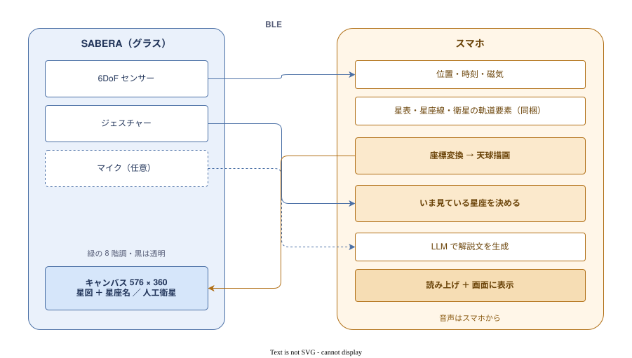
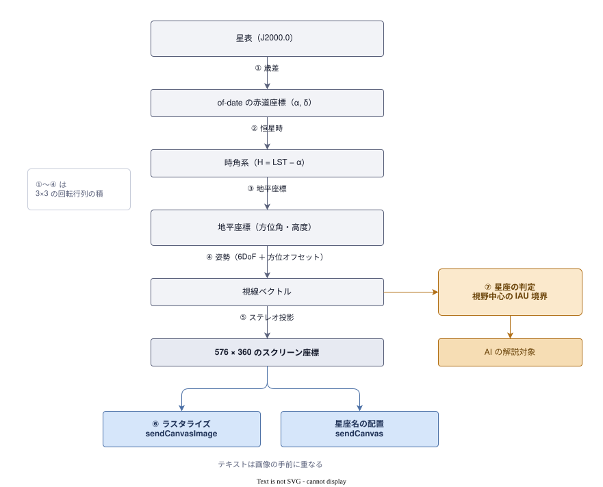

# 座標変換パイプライン

- 星表の「シリウスは赤経 6h45m、赤緯 −16.7°」を、グラスの「(x, y) = (120, 47) に点を打つ」へ
変換する仕様書
- **描画面は 576×360**。
- 間にある基準の違いは全部で以下の 4 つ
  - **星表は 2000 年基準**
  - **地球が自転している**
  - **観測地が違う**
  - **頭の向きが違う**

## 全体像

- **グラスは表示とセンサーに徹し、計算はすべてスマホ側**



- 座標変換のパイプラインは以下の通り



| 項目 | 決定 |
|---|---|
| 投影方式 | ステレオ投影 |
| FOV | 30〜40° |
| ロール | 地平線を水平に固定 |
| 星座の判定 | 視野中心が属する星座を IAU 境界で決める |
| 星表 | d3-celestial（BSD-3-Clause）を 5 等でフィルタして同梱 |
| 出力 | キャンバスの画像（`sendCanvasImage`）＋ テキストの星座名 |
| 音声 | スマホの `TextToSpeech`（SDK に音声出力 API が無い） |
| 方位 | 段階 1（スマホ同期）を標準、精度が要るときだけ段階 2 |

## 実装方針

### 内部表現は単位ベクトル

- 角度→角度で書くと、**天頂で方位角が定義できない**／**`cos h` で割れない**という 2 つの罠がある
- 単位ベクトルで持てば ①〜④ がすべて 3×3 の回転行列の積になり、特異点が消える。

```
v_screen = R_attitude · R_horizon(φ) · R_hourangle(H) · R_precession · v_catalog
```

- **歳差行列は起動時に 1 回、緯度の行列は場所が変わるまで固定**なので事前に合成しておく
- 毎フレーム変わるのは時角と姿勢だけ
- 1,627 個の星を毎フレーム変換するので効く

### 座標系の規約

- **符号バグの温床** 
- 実装では 1 箇所に定数として置く

| 決めること | 採用 |
|---|---|
| world 座標系 | ENU（X=東, Y=北, Z=天頂）。Android の `getRotationMatrix` と同じ |
| 方位角 | 北 = 0°、東回り |
| 手系 | 右手系 |

### 時刻とユリウス日

- **UTC をそのまま使ってよい。** `DUT1` は最大 13″、歳差への影響も無視できる
- **端末時計のずれは別問題。** 1 分で 0.25°、タイムゾーンの取り違えは 9 時間 = 135°
- **`D = JD − 2451545.0` を直接計算する。** `JD ≒ 2,460,000` を Double で持つと精度が落ちる
- `syncTime()` は時刻を**グラスへ送る**もので、こちらの計算には関係しない

## ① 歳差

- 自転軸が約 26000 年周期で首を振るため、赤経赤緯の原点がずれる
- **J2000 から 2026 年で約 0.36°** ＝ 満月の直径に近いので、無視すると星座線が明らかにずれる
- ただし、章動（17″）・固有運動（数十″）・光行差（20″）は無視してよい。

## ② 恒星時

```
GMST = 18.697375 + 24.065709824279 × D    （時間単位）
LST  = GMST + 経度 / 15                    （東経を正）
H    = LST − α
```

- 係数が 24 でなく 24.0657 なのは、**恒星日が太陽日より約 4 分短い**ため

## ③ 地平座標変換

```
sin h = sin φ · sin δ + cos φ · cos δ · cos H
A = atan2( −cos δ · sin H,  sin δ · cos φ − cos δ · sin φ · cos H )
```

大気差は高度 0° で 34′、10° で 5′、45° で 1′。地平線近く以外は無視できる。

## ④ 姿勢

| 量 | 可否 | 理由 |
|---|---|---|
| pitch・roll | **絶対値が取れる** | 加速度計が重力を測る |
| yaw | **絶対値が取れない** | 磁力計が無い |
| 方位の変化量 | 取れる（ドリフトする） | ジャイロの積分 |

**未知数は方位オフセット 1 つだけ。**

- `imuData` の 1 サンプル = 加速度[mg] / 角速度[dps] / ピッチ[度] / ヨー[度] / AR 起動からの経過[ms]。

- **`startImuData()` を呼ぶまで何も流れない**
- **`timestampMs` で間隔を計る。受信時刻を使わない**（BLE 経由で順序と間隔が乱れる）
- **送信キューが詰まるとサンプルが捨てられる**
- **ロールは融合値に無いので 3 軸加速度から自前で出す。**
  ピッチは取付補正済みなのに生の加速度軸は未文書なので、
  **グラスを水平に置いて加速度ベクトルを 1 回測り、基準を作る**

`sendNaviCourse` はファームにヨーの外部補正があることを示すが、**送る値を作る工程が
キャリブレーションそのもの**なので、これ自体は答えにならない。

## 方位キャリブレーション

### 必要な精度は用途で桁が違う

方位オフセットの誤差 δ に対する失敗率（高度 45°、FOV 40°、実データで測定）：

| δ | 星座の名前が変わる | 答えた星座が視野の外 |
|---|---|---|
| 5° | 24% | 0% |
| 10° | 41% | 0% |
| 15° | 62% | 0% |
| 20° | 75% | 1% |
| 25° | 83% | 8% |

**±20° まで、答えた星座はほぼ必ず視野の中にある。** ユーザーは点ではなく空の一帯を見ているので、
視野に入っている星座を答えるのは正解のうち。

一方、15° の誤差は星図を **10.6°** ずらす。FOV 40° なら画面の 1/4。

| 用途 | 要求精度 |
|---|---|
| 解説する星座を決める | ±20° |
| ラベルを方向に置く | ±5〜10° |
| 星図を空に重ねる | ±2〜3° |

**解説だけなら段階 1 で足りる。星図を重ねるなら段階 2 が要る。**

### 段階 1：スマホ同期（標準）

- スマホを顔の前にかざしてもらい、その瞬間の「スマホの磁気方位 − グラスの `yawDegrees`」をオフセットにする
- 以後はジャイロで追従する

- **星の名前を知らなくてよい。昼でも夜でも、曇っていてもできる**
- 誤差は磁気（±5〜15°）＋ 向きを揃える精度（±10°）
- **再同期が安いので、ドリフトが速くても運用が成立する**

スマホの磁気が示すのは**スマホの方位**であってグラスの方位ではないため、
**常時融合する定石は使えない。** 向きを揃える瞬間を作って移すしかない。

### 段階 2：天体アライメント（精度モード）

スマホのカメラで空を映し、画面中央のレティクルに明るい天体を入れてタップする。
スマホの向き（磁気＋重力）から「そこにあるはずの天体」を逆算して同定し、
その天体の真の方位からオフセットを決める。**ユーザーは名前も方位も知らなくてよい。**

- **基準天体は高度 20〜40° を選ぶ。** 誤差の伝播が `1 / cos h` なので、
  高い天体で校正すると誤差が拡大する（高度 80° で 5.8 倍）
- **2.5 等まで含めればどの月でも 10 個以上**が使える高度にいる（東京で確認済み）

別案として、**グラスに星図を出して姿勢ごと凍結し、左右に首を振って空に重ねてもらう**方式がある。
名前も方位も要らず、グラス単体で完結し、調整中は画像が凍結しているので転送コストがゼロ。
**パネルの取り付け誤差も一緒に吸収できる。**

### 昼間

| 手段 | 昼 | 夜 |
|---|---|---|
| 段階 1 | 使える | 使える |
| 段階 2・太陽で照準 | 使える | — |
| 段階 2・恒星で照準 | — | 使える |

- **グラスの視野中心に太陽を入れさせてはいけない。** 太陽の直視になる。
  太陽を使うなら**スマホのカメラ越し**に限る
- 太陽は位置計算が簡単で視差も 8.8″、**基準天体としては最も正確**
- 月を使うなら**地心視差の補正が必須**（最大 57′）

## ⑤ 投影

### ステレオ投影

| 方式 | 式 | 保つもの | FOV 40° の歪み |
|---|---|---|---|
| 心射図法 | `r = tan θ` | 大円が直線になる | 6.4% |
| **ステレオ投影** | `r = 2 tan(θ/2)` | **角度と形（等角）** | **0%** |

**星座の「形」を見せて同定させる**のが本質なので等角を優先した。
星座線は円弧になるが、**5° ごとの折れ線に分割すれば実用上の差は無い**。

### FOV 30〜40°

空のサイズ：満月 0.5° / こぶし 10° / **オリオン座 20°** / 北斗七星 25° / さそり座 40°

| FOV | 576px での解像度 | 5 等まで視野内 |
|---|---|---|
| 20° | 28.8 px/度 | 15 個 |
| **30°** | 19.2 px/度 | 33 個 |
| **40°** | 14.4 px/度 | 58 個 |
| 60° | 9.6 px/度 | 129 個 |

**576px あるので、潰れを理由に FOV を狭める必要はない。** オリオン座が画面の半分〜2/3 を
占める大きさとして 30〜40°。パネルは **16:10** なので横 40° なら縦 25° で、**星座は縦に切れやすい**。

### ロールは地平線を水平に固定

**ロール誤差は視野中心を動かさない**（中心まわりの回転）ので、**⑦ の星座判定には影響しない**。
効くのは絵だけで、中心から r 離れた星が `r · sin θ` ずれる。

| | 首を傾けたとき | 転送 |
|---|---|---|
| **固定** | パネル上の絵は変わらない | **再送ゼロ** |
| 追従 | 絵が回る | 傾けるたびに全フレーム再送 |

**BLE で全フレームを送る以上、頭に追従する登録済みオーバーレイは原理的に無理。**
追従を名乗ると遅れて回り、**追従しない参照図より悪くなる**。

ロールが 15° 程度を超えたときだけ再描画するデッドバンド付き追従を逃げ道に残し、
投影段のパラメータにしておく。

## ⑥ ラスタライズ

```kotlin
fun sendCanvasImage(x: Int, y: Int, width: Int, height: Int, grayscale: ByteArray)
```

- **`x + width` は 576、`y + height` は 360 まで**
- **1 画素 1 バイトのグレースケール**（0-255、左上から行優先）
- **3bit への量子化と RLE 圧縮は SDK が行う。エンコーダを自前で書かない**
- **置けるのは 1 枚だけ。** ナビ表示中は使えない（バッファを共有している）
- `FEATURE_VERSION 2.2.0` 以上が要る。**手元のグラスは更新済みで動く**（実機で確認）。
  古いファームでは `enterImageDisplayPage` ＋ `sendImage`（196×196、星図だけ）が退路
- **映るのは緑の 8 段。** API の契約はグレースケールなので、**緑の値を作って渡すのではない**

### 転送量

星表を仕様どおりに描き、3bit へ落として素朴な RLE にかけた見積もり：

| サイズ | 生 | RLE 後 |
|---|---|---|
| 196×196 | 38,416 B | 約 1,200 B |
| **576×360** | 207,360 B | **約 4,200 B** |
| 576×360（星座線なし） | 207,360 B | **約 1,700 B** |

- **星図は 98% が黒なので、全面に広げても 196×196 の約 3.5 倍**で済む
- **星座線が転送量の半分以上を占める。** 間に合わないときはまず線を間引く
- SDK の RLE 実装は未公開なので、実測で確かめる

### 点の大きさは画素数に比例させる

**576px に描くと 1px の点が 0.059° になる。** 196px のとき（0.173°）の 1/3 で、
そのままでは実機で見えない。点の半径を `width / 196` 倍にすると、
光る画素が 1,236 → 6,362 に増えた（576×360・5 等・星座線あり）。

### 明るさ

波導は黒が透明なので、**光っている画素だけが肉眼の空を邪魔する**。
**屋内で決めた明るさは屋外の暗闇では確実に明るすぎる**ので、
等級の表現は全体の明るさ（`BRIGHTNESS_LEVEL`）とセットで決める。

### 送信待ちを積ませない

日周運動は **15″/秒**（4 分で 1°）なので静止していても更新が要るが、
首を振ると姿勢のほうが速く変わり、**古いフレームが順番待ちで積む**。
`GlassClient.cancelPendingPackets()` で捨てられそうだが上流の本文が未執筆。

**マイクを流すと毎秒 32,000 バイトが同じ BLE を通る**ので、星図の転送と食い合う。

### 星座名はテキストで重ねる

- `CanvasElement(id, x, y, width, height, text)`。**8 個まで・合計 190 バイトまで**
- 星座名は平均 14.8 バイトなので、**8 個並べて約 118 バイト**で収まる
- FOV 40° の視野に入る星座は**平均 5.2 個・最大 11 個**。**8 個枠はちょうど足りる**
- **テキストは画像の手前に描かれる**ので、星図とラベルが同じ画面に出る
- **画像を焼き直さずにラベルだけ差し替えられる**（`sendCanvasElements`）

## ⑦ いま見ている星座を決める

- 星座は「点」ではなく天球上の不定形な領域なので、「この点はどの領域に属するか」という判定が必要になる
- そこで導入したのが、**IAUの星座境界**
- これは、星座は本来天球全体を隙間なく塗り分けた88個の領域として定義されている
- これにより、1点が属する星座は一意に定まる

実装は **Roman (1987) の境界表**（357 行、`astropy.get_constellation` の中身）が第一候補。
**B1875 系なので of-date → B1875 の歳差が要る**。d3-celestial の `constellations.borders.json` は
閉じた多角形ではなく隣接ペアの境界線なので、描画向き。


- ラッチ値とヒステリシス
  - IAU境界による判定自体は数学的に一意だが、これを生のセンサーデータに適用すると、以下の2種類のノイズが起きてしまう
  - ツルをタップすると頭が動いてしまう
    - 判定はタップ直前 0.5 秒ほどのラッチ値から取る
  - 継続的な揺れ対策
    - 人間の頭は完全に静止することなく、常に微小に揺れている
    - 単に境界を超えたら、即座に切り替えるのではなく、
      1. 境界から一定の角度だけ内側にしっかり踏み込む
      2. その状態が一定時間維持されたときにだけ、表示している星座を切り替える

## 星表データ

- `tools/build-star-catalog.py` が [d3-celestial](https://github.com/ofrohn/d3-celestial)（BSD-3-Clause）から取得・変換
- 生成物は `data/`

| ファイル | サイズ | 中身 |
|---|---|---|
| `data/stars.json` | 49 KB | 5 等までの恒星 1,627 個 |
| `data/constellations.json` | 21 KB | 88 星座の星座線＋日本語名 |
| `data/bright-stars.json` | 3 KB | 固有名のある 25 星 |

- 元期は **J2000 を実測で確認済み**（シリウス 0.7″、ポラリス 1.8″ の差＝丸め誤差の範囲）
- **座標は `[lon, lat]` で `lon` は −180〜180 に折り返されている。**
  赤経に戻すには `RA = lon < 0 ? lon + 360 : lon`
- 日本語名は `tools/names-ja.json`。**88 星座すべてが埋まっていないと生成が止まる**
- 帰属表示は `NOTICE`（BSD-3-Clause ＋ XHIP）
- **夜空の下は電波が悪いので、外部 API は使わずアプリに同梱する**

## 実測しないと決められないこと

優先順に：

1. **`sendCanvasImage` 1 枚の転送時間** — 更新レートの上限。
   576×360 と 196×196、星座線あり／なしで比べる。サンプルの `CanvasScreen` から始められる
2. **段階 1 だけで星座同定が成立するか**
3. **パネルが視野の何度を占めるか** — FOV が決まる
4. **グラス機体座標の軸定義** — **ロールを実装する前に必ず潰す**
5. **ヨードリフト率** — 何分ごとに合わせ直すかが決まる
6. **ラベルの読みやすさ** — 8 個並べて重ならないか、緑 8 階調で読めるか
7. **屋外での適正な明るさ**

SDK チームへの質問は、**`sendNaviCourse` の補正が `imuData` に返るか**、
**`SettingKey` の値の意味と範囲**、**`parseResponse` の読み出し経路**、
**`cancelPendingPackets` の挙動**、**パネルの表示画角**。
